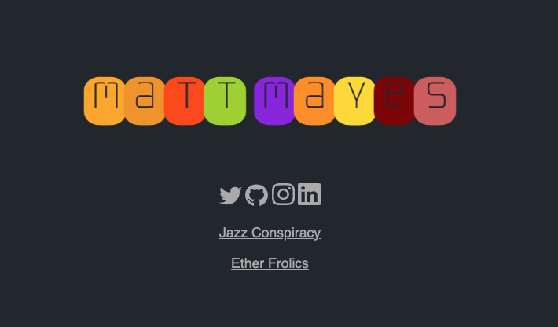

# MattMayes.com

My personal site, which can change without notice. If you are looking for the previous Hugo-based blog, it is [here](https://github.com/stoptime/mattmayes-hugo).

I work in the web realm - currently all backend stuff.

I enjoy [brewing](https://github.com/stoptime/brew), playing guitar, & bbq’ing several times a week, weather be damned. You can often find me working on the endless home projects that come with owning a 100 year old Chicago two-flat.

My wife and two noisy cats offer running commentary.
